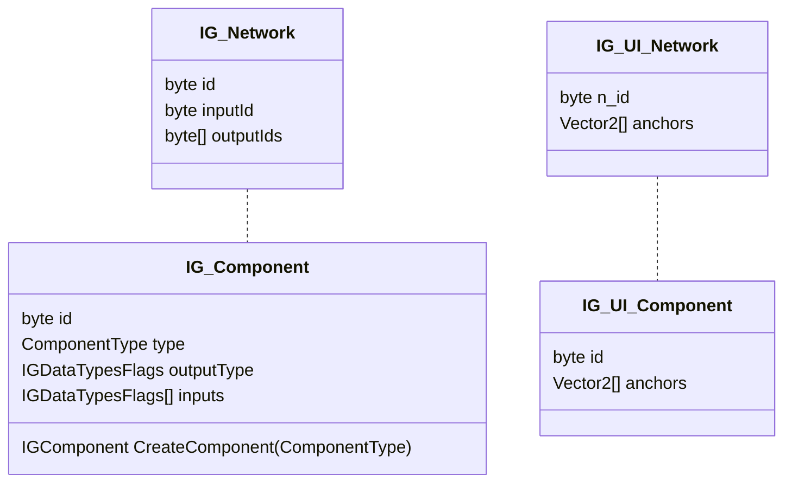

# UI class diagram

```mermaid
classDiagram
    class IG_Network {
        byte id
        byte inputId
        byte[] outputIds
    }
    
    class IG_Component {
        byte id
        ComponentType type
        IGDataTypesFlags outputType
        IGDataTypesFlags[] inputs

        IGComponent CreateComponent(ComponentType)
    }

    class IG_UI_Network {
        byte n_id
        Vector2[] anchors
    }
    
    class IG_UI_Component {
        byte id
        Vector2[] anchors
    }

    IG_Network .. IG_Component
    IG_UI_Network .. IG_UI_Component


```